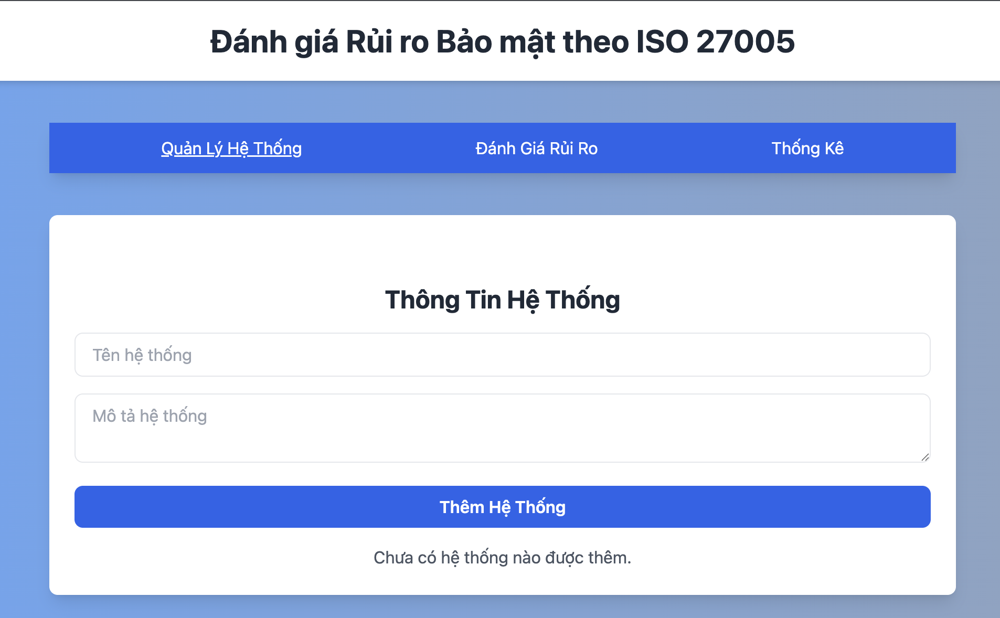
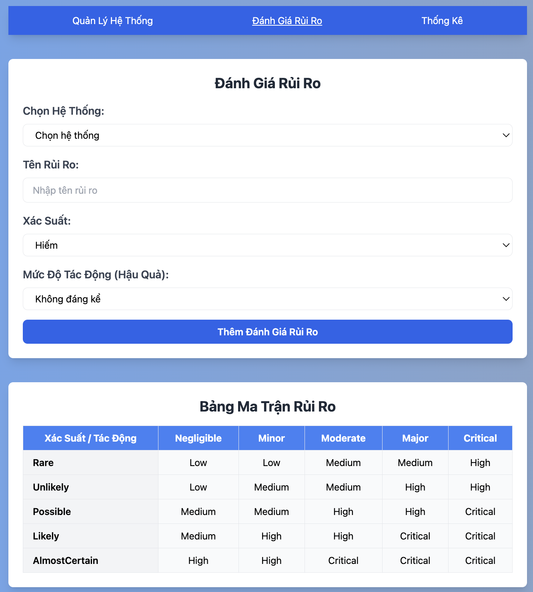
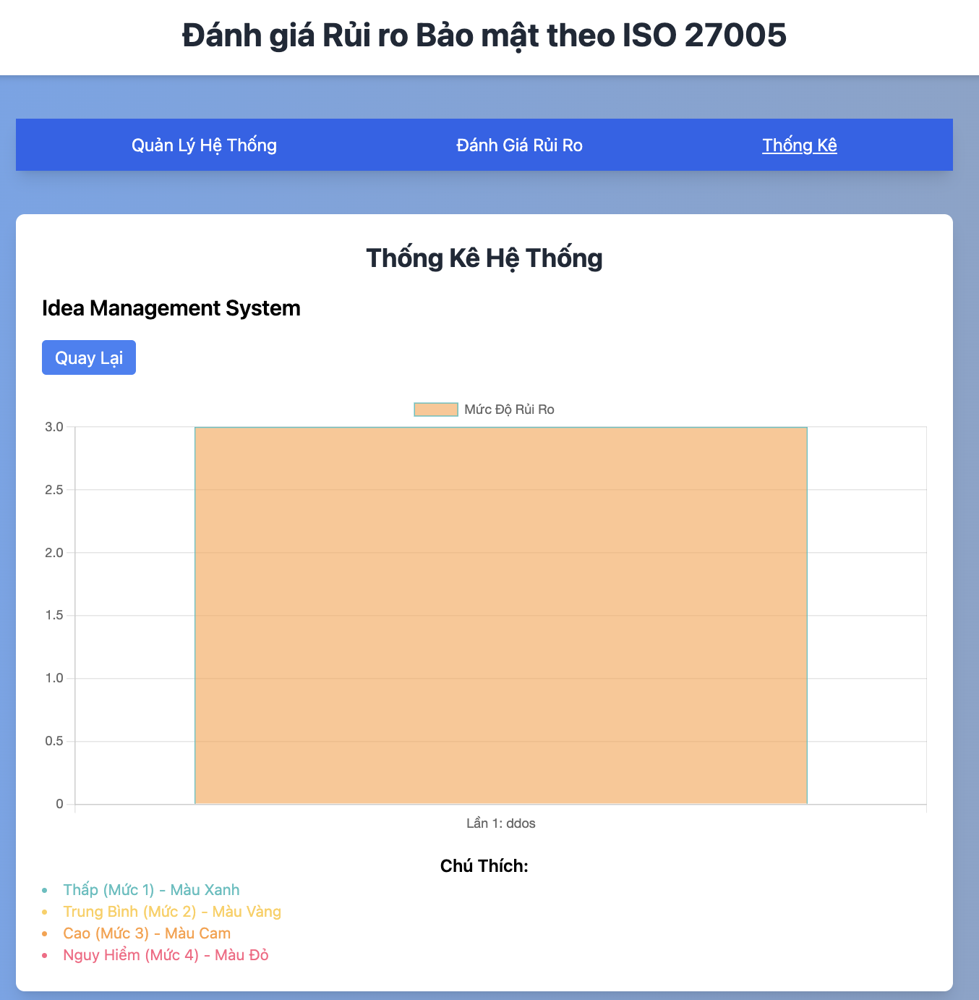

# PROJECT 2: Security risk assessment algorithm using risk matrix analysis
In the context of cybersecurity becoming increasingly important, especially in DevOps systems, security risk assessment and management becomes an essential task to protect the system from potential risks. This project focuses on researching and developing a security risk assessment algorithm using risk matrix analysis, to classify and evaluate threats in DevOps systems.
## INTRODUCTION
### 📌 **Project objectives**
- Build a risk assessment algorithm based on a risk matrix.
- Test the algorithm on real or simulated data.
- Provide appropriate solution suggestions for each type of risk.

### 🔍 **Reasons for choosing the topic**
- Quick and accurate risk assessment is essential in a DevOps environment.
- Helps minimize the risk of system insecurity.

### 🎯 **Expected results**
- Develop a risk level classification algorithm.
- Display suggested solutions corresponding to each risk level.
- High applicability, especially in security management in DevOps.

### 🔧 **Main functions**
1. **Add risk types**
- Add risk types to the system for evaluation.
2. **Add/Edit/Delete attack types and levels**
- Manage the list of attack types and levels of danger.

3. **Display the danger level as a table**
- Create a table to classify the danger level according to the risk matrix.

4. **Provide solution suggestions**
- Provide solutions based on the risk classification results.

### ⚙️ **Implementation method**
1. **Build an algorithm based on the risk matrix**:
- Apply risk analysis and system security methods.

2. **Test on real/simulated data**:
- Evaluate the efficiency and accuracy of the algorithm.

3. **Optimize the algorithm**:
- Improve the classification ability and expand the application to other systems.

#### Hình ảnh minh họa




## 🛠️ **INSTALL**
1. **Clone repo**:
   ```sh
   git clone https://github.com/MaiNghiaa/risk-evaluation-app.git

2. **Dependence**:
   **If you already have nodejs**
   ```sh
   npm install
   ```
   **If you don't have nodejs**
4. **RUN**
   ```sh
   npm run start
   ```

## STRUCTURE
**Risk-evaluation-app
- public
- src
  - app.js
  - components
    - Navbar.js
    - RiskAssessmentForm.js
    - ...
  - index.js
- package.json
- .....

## TECH
- Reactjs
- TailwindCss
- Axios

## CONTACT

**Email:_"nghia.mt1505@gmail.com"_

**[DEMO](https://risk-evaluation-gcebjocjv-mainghiaas-projects.vercel.app/)
